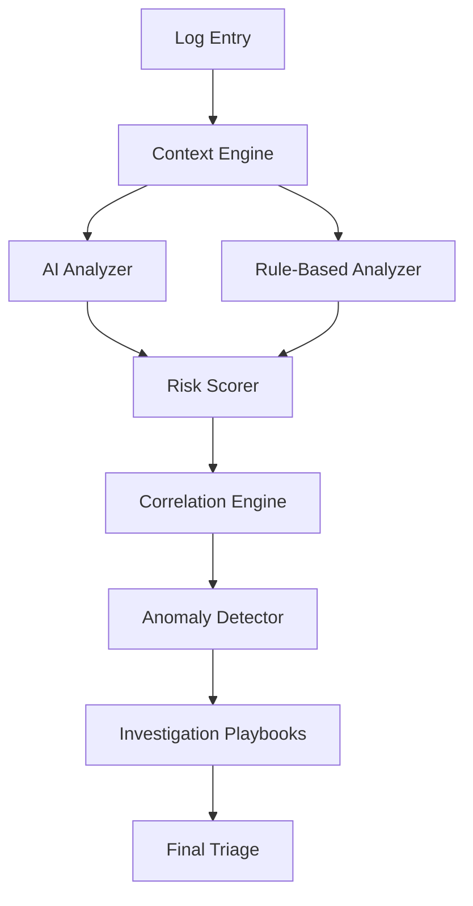

# 🛡️ Sentra - SOC Triage Copilot

Sentra is an intelligent security alert triage assistant that helps SOC analysts cut through the noise and focus on what actually matters.

### What Sentra Does

Sentra sits between your logs and your analysts, acting as an intelligent triage layer that:

##  Adds Context That Actually Matters
- **Asset criticality** - Domain controller vs test workstation
- **User privilege levels** - Admin account vs regular user  
- **Temporal context** - Business hours vs 3 AM on Sunday
- **Network indicators** - Internal traffic vs sketchy external IPs

##  Tells You What to Investigate (Investigation Playbooks)
### Sentra provides:
- **Specific checklist** - "Check if multiple usernames tried from same IP"
- **What makes it suspicious** - "5+ failures in 10 minutes"
- **What to check next** - "Look for Event ID 4624 after the failures"
- **MITRE ATT&CK mapping** - "T1110 - Brute Force"


Sentra will also provide risk score based on 
+ Base Severity (30 points)
+ Critical Asset - Domain Controller (30 points)
+ After Hours Activity (15 points)
- Known Pattern - Usually Benign (-10 points)


Confidence: 81%
False Positive Probability: 20%

## You can see the reasoning, not just the conclusion.


## How It Works




## Quick Start

### Prerequisites
- Python 3.9+
- Claude API key (optional - works without it)

### Installation

```bash
# Clone the repo
git clone https://github.com/Lidor-1/Intelligent-SOC-Alert-Triage-Assistant
cd Intelligent-SOC-Alert-Triage-Assistant

# Install dependencies
pip install -r requirements.txt

# Optional: Set up Claude AI integration
export ANTHROPIC_API_KEY="your-api-key-here"

# Run it
python main.py
```

## Configuration

Edit `config.yaml` to customize for your environment:

```yaml
# Define critical assets
critical_assets:
  - dc          # Domain Controllers
  - sql         # Database servers  
  - prod        # Production servers

# Define privileged users
privileged_users:
  - admin
  - root
  - svc_        # Service account prefix

# Business hours
business_hours:
  start: 8      # 8 AM
  end: 18       # 6 PM

# Internal networks
internal_networks:
  - "10."
  - "172.16."
  - "192.168."
```

## FAQ

**Q: Does this replace SIEM?**  
A: No. Sentra is designed to work WITH your existing tools. It's a triage layer that helps analysts prioritize and investigate alerts more efficiently.

**Q: Do I need Claude API?**  
A: Nope. Sentra works perfectly fine with rule-based analysis. Claude adds more nuanced reasoning, but it's optional.

**Q: What log formats are supported?**  
A: Currently JSON, Windows Event Logs (EVTX), syslog, CSV/TSV. Easy to add more formats in `log_parser.py`.

**Q: How accurate is it?**  
A: Depends on your configuration. The more you configure `config.yaml` and provide feedback, the better it gets.

**Q: Does it send my logs anywhere?**  
A: Only to Claude API if you configure it (and only the current event being analyzed). Otherwise, everything runs locally.
